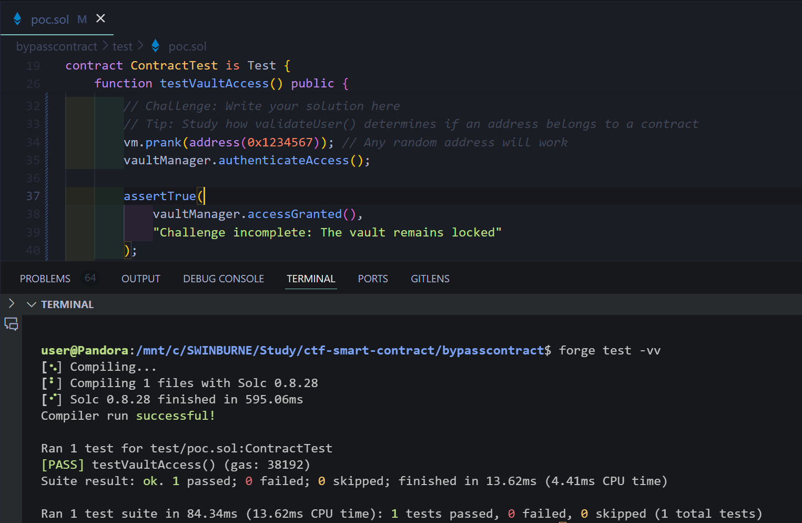

# Pentest Report for bypasscontract.sol

> Author: Tran Thanh Minh
> 

<aside>
🏦

The `VaultManager` smart contract is designed to restrict access to non-contract addresses. If the address belongs to a contract indicated by a non-zero code size, access is denied. 

</aside>

# Table of contents

---

# Vulnerability

The vulnerability lies in the method used to determine whether the caller is a contract. The `extcodesize` assembly opcode is used in `validateUser` to check the code size of the caller’s address. It can be bypassed by contract that invoke the function during their construction phase. This is because `extcodesize` returns `0` for contracts during their construction phase, as the code is not yet stored on-chain. This is one of the [OWASP Smart Contract Top 10](https://owasp.org/www-project-smart-contract-top-10/2023/en/src/SC04-access-control-vulnerabilities.html) which belong to access control vulnerabilities. 

# Exploit development

To exploit the vulnerability, I can spoof an address using `vm.prank` (line 16) in the test environment provided by Foundry. the test simulates an externally owned account sends transaction, and bypass the `validateUser` function and gain access. 


Test the exploit for `VaultManager` contract

# Explanation of Exploit

In the `testVaultAccess` function, the `vm.prank` utility used to simulate a transaction originating from an address. It is used with an address not associated with a deployed contract, the `extcodesize` check in `validateUser` returns `0` , as the address does not contain any code. This will bypass the restriction in the `authenticationAccess` function and set the `accessGranted` to `true`



The exploit work perfectly

So the address I use to bypass in this case is `0x1234567`

Formatted flag: `CTF{0x1234567}`

# Mitigation

The vulnerability is in the `validateUser` function, specifically the check on `extcodesize(account)` (line 8) to determine if the sender is a contract or an externally owned account. The only change is changing the comparison from `> 0` to `== 0`


Mitigation for `VaultManager` contract

This will ensure only external owned accounts to access the vault and not contracts. This is more secure because when the `codeFootprint` is exactly `0` , meaning that the address has no code. If the contracts have code, or the address is a contract, `extcodesize` will return a value grater than 0 which means the contracts will be rejected. 

Test again but fail to exploit: 


# Resource

Test case and `VaultManager` contract after mitigation: 

```solidity
// SPDX-License-Identifier: MIT
// Find the vuln, write the exploit POC, how to mitigate, and what is the flag
pragma solidity ^0.8.18;
import "forge-std/Test.sol";
import "@openzeppelin/contracts/utils/Address.sol";

/*
Your mission: Find a way to bypass this security measure.
Objective: Make vaultManager.accessGranted() return true
Difficulty: Medium
FLAG FORMAT: "CTF{address_that_succeeded}"

RULES:
1. The VaultManager contract cannot be modified
2. You can only write code in testVaultAccess()
3. The vault must be accessed programmatically
4. No external contract deployments allowed
*/
// Flag: CTF{0x1234567}
contract ContractTest is Test {
    VaultManager public vaultManager;

    constructor() {
        vaultManager = new VaultManager();
    }

    function testVaultAccess() public {
        assertFalse(vaultManager.accessGranted(), "Invalid initial state");

        vm.expectEmit(true, true, true, true);
        emit VaultManager.AccessGranted();

        // Challenge: Write your solution here
        // Tip: Study how validateUser() determines if an address belongs to a contract
        vm.prank(address(0x1234567)); // Any random address will work
        vaultManager.authenticateAccess();

        assertTrue(
            vaultManager.accessGranted(),
            "Challenge incomplete: The vault remains locked"
        );
    }
}

contract VaultManager {
    bool public accessGranted;
    event AccessGranted();

    function validateUser(address account) public view returns (bool) {
        uint256 codeFootprint;
        assembly {
            codeFootprint := extcodesize(account)
        }
        return codeFootprint == 0;
    }

    function authenticateAccess() external {
        require(
            !validateUser(msg.sender),
            "Access denied: Contracts not allowed"
        );
        accessGranted = true;
        emit AccessGranted();
    }
}

```