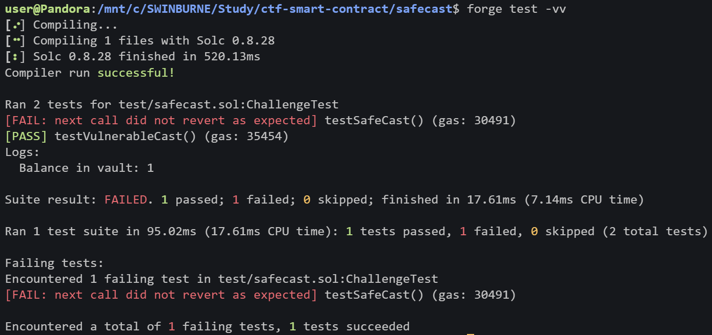

# Pentest Report for safecast.sol

> Author: Tran Thanh Minh
> 

<aside>
🏦

There are 2 Solidity smart contracts `Vault` and `SecureVault` . Both contracts allow users to store and retrieve a numeric value, but they handle this value in different ways. 

</aside>

# Table of contents

---

# Vulnerability

There are 1 vulnerabilities in these 2 contracts. The vulnerability is one of [the OWASP Smart Contract Top 10](https://owasp.org/www-project-smart-contract-top-10/2023/en/src/SC02-integer-overflow-underflow.html) which belong to Integer Overflow and Underflow.


Vulnerable `Vault` contract

The `Vault` contract has vulnerable `store` function (line 3). This function casts the `uint256 value` input into a `uint8` without proper validation. The `uint8` type can only hold values between `0` and `255` , but if the input `value` exceeds 255, it will undergo truncation, and only get the result in value between 0 and 255, no matter the input being much larger. This can cause unexpected behavior, larger values can be truncated to the values within the allowable range for `uint8` . This vulnerability can be used by attacker to manipulated the stored value. 

# Exploit Development

The overflow happens when a value greater than `255` is passed to the `store` function. `uint256` value is cast to a `uint8` , which can only hold values between `0` and `255` . When larger value is passed, it will overflow and wrap around , causing unexpected value to be stored in the contract. 


Test case for the vulnerable `Vault` contract

# Explanation of Exploit

In the test `testVulnerableCast`, the `store` function receive `257` , which will cast this value to `uint8` , causing the overflow to `1` . The attacker then retrieve the stored value using `vault.retrieve()` , which will return `1`  . When a value is greater than `255`, is passed to the `store` function, the value will be truncated because `257 % 256 = 1`, leading to unexpected behavior of the contract. And the attacker can see the result with `retrieve` function. 



Result of both 2 tests

The `internalHash` has the value of `466c61675f5377246e4275356e335f564e` . When decrypted, the hidden flag is `Flag_Sw$nBu5n3_VN`

Formatted flag: `CTF{Flag_Sw$nBu5n3_VN}`

# Mitigation

The `store` function in `Vault` contract should be modified: 

 


Mitigation for `Vault` contract

This mitigation will ensure the proper range validation, and the value being passed is within the acceptable range (0 to 255). If the value exceeds this range, the transaction should be reverted. 

This mitigation also can be implemented for `SecureVault` also. 

# Resource

Test case and `Vault` and `SecureVault` contract

```solidity
// SPDX-License-Identifier: MIT
// Find the vuln, write the exploit POC, how to mitigate, and what is the flag
pragma solidity ^0.8.18;

import "forge-std/Test.sol";

contract ChallengeTest is Test {
    Vault public vault;
    SecureVault public secureVault;

    function setUp() public {
        vault = new Vault();
        secureVault = new SecureVault();
    }

    function testVulnerableCast() public {
        vault.store(257);
        console.log("Balance in vault:", vault.retrieve());
        assertEq(vault.retrieve(), 1);
    }

    function testSafeCast() public {
        vm.expectRevert();
        secureVault.store(1);
        assertEq(secureVault.retrieve(), 1);
    }

    receive() external payable {}
}

contract Vault {
    mapping(address => uint) private records;
    function store(uint256 value) public {
        require(value <= 255, "Value must be less than or equal to 255");
        uint8 limitedValue = uint8(value);
        records[msg.sender] = limitedValue;
    }
    function retrieve() public view returns (uint) {
        return records[msg.sender];
    }
}

contract SecureVault {
    mapping(address => uint) private records;
    bytes32 private internalHash = hex"466c61675f5377246e4275356e335f564e";
    function store(uint256 value) public {
        require(value <= 255, "Value must be less than or equal to 255");
        uint8 limitedValue = uint8(value);
        records[msg.sender] = limitedValue;
    }
    function retrieve() public view returns (uint) {
        return records[msg.sender];
    }
}

```